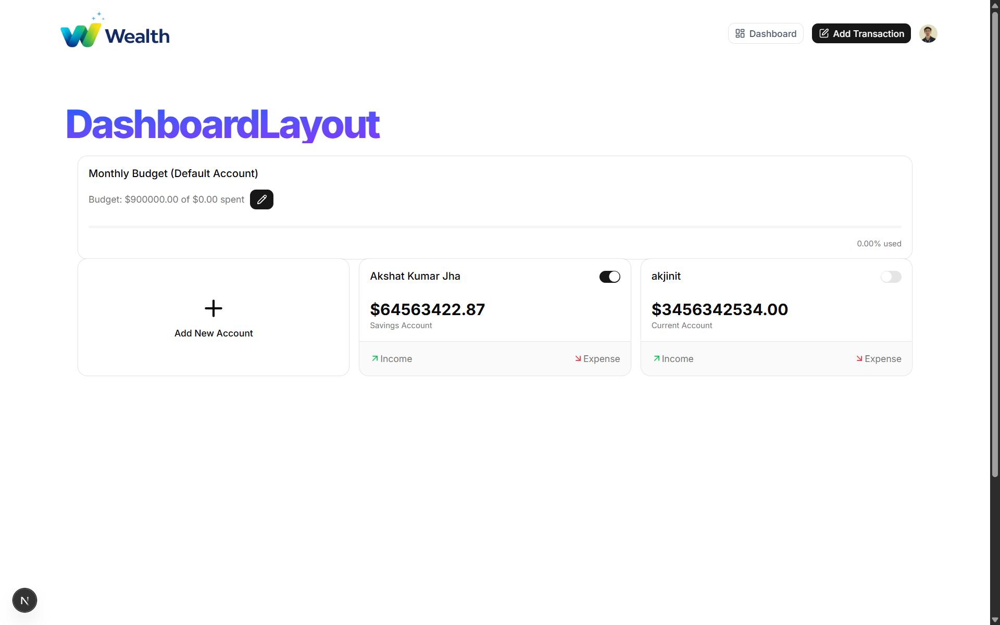
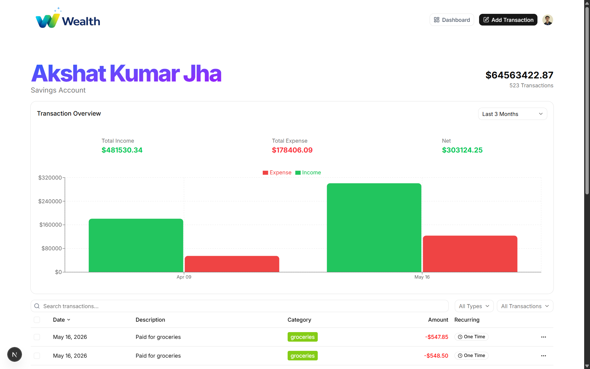

# Ai-Finance

A personal finance dashboard built with Next.js. This app helps users track accounts, budgets, and transactions in a clean, responsive interface.

## Features

- User authentication and secure sign-in / sign-up flows
- Dashboard with budget progress, account overviews, and expense summaries
- Account detail pages with transaction history and charts
- Transaction creation and category selection
- Seed data support via API route for local development

## Tech Stack

- Next.js 14+ with the App Router
- React and client/server components
- Custom UI components in `components/ui`
- Local data and actions in `actions/`
- Public assets in `public/`

## Run Locally

```bash
npm install
npm run dev
```

Open `http://localhost:3000` in your browser.

## Screenshots

### Dashboard


### Accounts



### Transaction form



## Project Structure

- `app/` – main application routes and page layout
- `components/` – reusable UI components and drawer/menu controls
- `actions/` – server actions and data helpers
- `lib/` – utility helpers and database access
- `models/` – data models used by the app
- `public/` – static assets and screenshots

## Notes

The screenshot files in `public/` were renamed to:

- `screenshot-dashboard.png`
- `screenshot-accounts.png`
- `screenshot-transaction.png`
